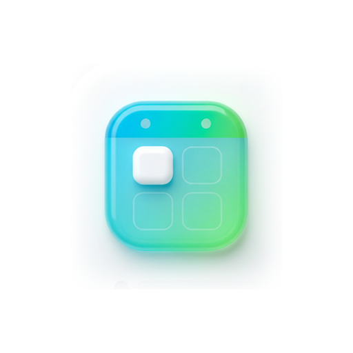
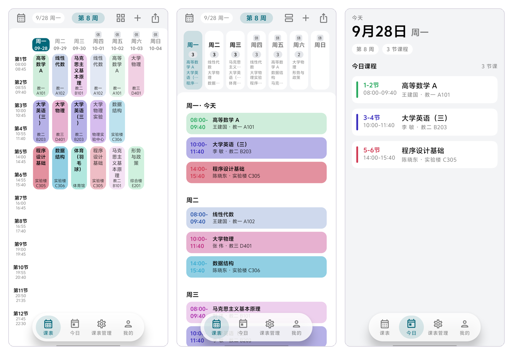
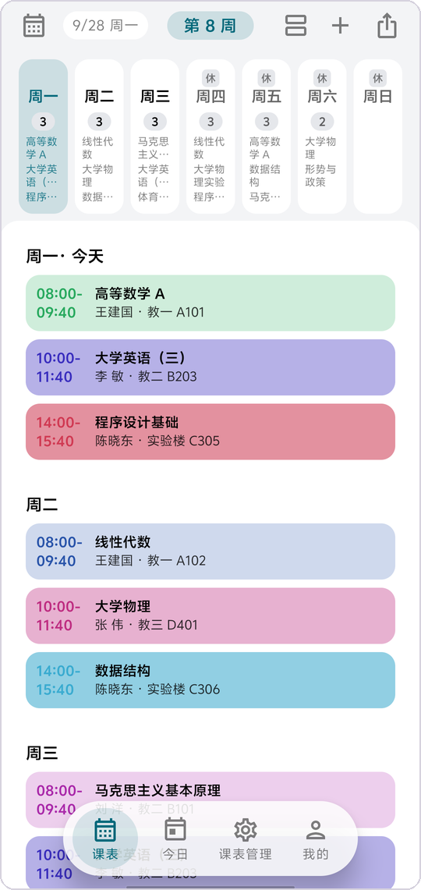
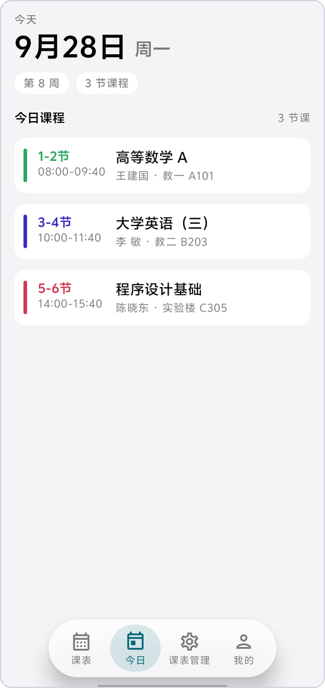
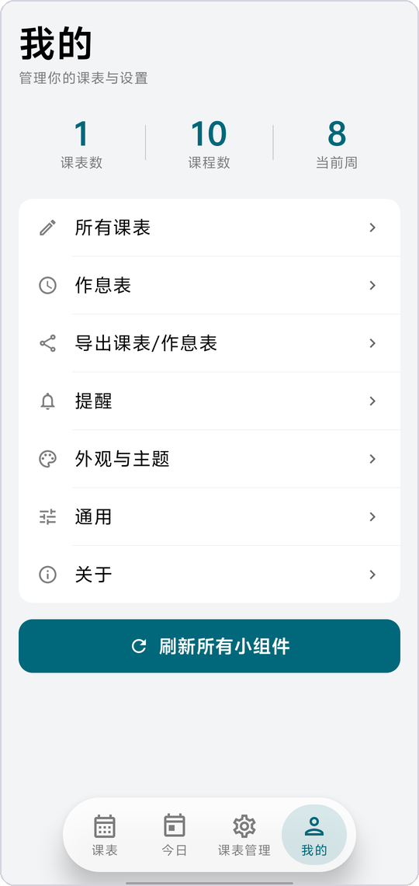

<p align="center">
  
</p>

<h1 align="center">Classy 课表</h1>

<p align="center">
  <strong>一个没有广告的 Android 课程表。</strong><br>
  本地优先 · 默认不联网 · 只做「看一眼今天上什么课」这一件事。
</p>

<p align="center">
  <a href="https://github.com/IMSX3D/Classy/releases"></a>
  
  
  
  
  
</p>

<p align="center">
  <a href="#中文">简体中文</a> · <a href="#english">English</a> ·
  <a href="https://github.com/IMSX3D/Classy/releases">下载 APK</a> ·
  <a href="https://github.com/IMSX3D/Classy/issues">问题反馈</a> ·
  <a href="#联系作者">QQ 547991704</a>
</p>

<p align="center">
  
</p>

---

<h2 id="中文">简体中文</h2>

## 为什么会有这个东西

市面上的同类产品，不少都走向了过度商业化。要么一打开就是开屏广告，硬控你 3–5 秒，还带摇一摇；要么在 App 里塞进各种垃圾广告，把原本清晰可观的课程表搅成一团乱麻。

可大家用课程表软件的初衷，不过是想单单纯纯地看一眼今天、或者某一天的课程安排。没人想被按着头看完那些与自己无关的内容。

我始终认为，一个工具就该有一个工具的样子：纯粹的、简洁的、美观的。**Classy 课表**就是照这个想法做的 —— 它不弹广告、不做埋点、不催你登录，数据默认只存在你自己的手机里。

## 它是什么

| 项 | 值 |
|---|---|
| 包名 | `com.imsx3d.classy` |
| 版本 | `v0.0.1`（本仓库初版） |
| 最低 / 目标 SDK | `26`（Android 8.0）/ `37` |
| 架构 | arm64-v8a · armeabi-v7a · x86_64 |
| 语言 | 简体中文 · 繁體中文 · English · 日本語 · Español |
| 许可 | GPL-3.0 |

## 特色

- **没有广告，也没有埋点。** 不集成任何广告或数据统计 SDK，包内没有 Firebase / Crashlytics / Sentry 之类的东西。
- **本地优先。** 课表保存在本机数据库里，打开即用、离线可用。全程只有三个地方会联网：教务直连导入、节假日数据、版本更新检查 —— 都不影响日常使用。
- **深浅双主题，主题色可换。** 浅色 / 深色两套完整配色，可跟随系统也可手动指定；主题色支持 Material You 动态取色（Android 12+）、5 套内置预设，还能用取色器自己调一个存下来（见下方「主题与配色」）。
- **三种视图。** 网格（课表格子，默认）、周视图（按天铺开整周）、今日（今天几节课、几点上、在哪上）。
- **课程色怎么用，你说了算。** 同一套配色有两种承载方式：**填充**（整块用课色，默认）或 **色条**（颜色只占左缘一条 + 时间用课色，更克制），在「通用 → 课表显示 → 课程色呈现」里随时切换；配色跟随主题，深浅两种模式下各自取值。
- **三个桌面小组件。** 今日课程 / 最近两天 / 本周课表（网格）。全部是真实行布局，内容超出卡片高度时可以滚动，不压缩、不形变；配色跟 App 主题实时同步。
- **教务直连导入。** 内置 345 所高校的教务适配（正方 / 强智 / 金智 / URP / 青果 / 超星 等协议族），WebView 登录后**本地**解析，课表不进任何第三方服务器。
- **格式不锁死。** 支持 Classy 原生格式、ICS 日历、CSV、WakeUp 分享文本 / JSON、教务系统 HTML 表格；导出也是一等公民，随时能带走。
- **一套统一的设计体系。** 控件、字体、动效各有一份规范文档与红线脚本约束，全 App 只有一套设置页版式、一套分段控件、一套动效曲线 —— 不出现"某个页面看着就不像这个 App"的突兀感。
- **小。** Release 单架构 APK 约 4.0 MB（3914 KB）。

## 截图

| 截图 | 说明 |
|---|---|
|  | **网格**（默认视图）—— 7 日 × 节次的课表格子。今天那一列有主色胶囊，左右滑动切周，自动算当前周次；假日会在表头标「休」「补」。 |
|  | **周视图** —— 按天铺开的整周列表，一门课一行，滚动看完整周。 |
|  | **今日** —— 今天上什么、几点上、在哪上。没课的日子也有明确交代。 |
|  | **我的** —— 课表管理、作息表、导出、提醒、外观与主题、通用设置。 |

> 截图为演示数据（虚构课程），不是任何人的真实课表。视图名称与 App 内「通用 → 启动默认页」一致。

## 主题与配色

浅色与深色是**两套完整配色**（不是把浅色反相），语义色、卡片层次、课程色都各自调过，深浅两边都好看。

<p align="center">
  
</p>

<p align="center"><sub>深色模式：网格 / 周视图 / 今日</sub></p>

主题色的来源有三条路，都在「我的 → 外观与主题」里切换：

| 方式 | 说明 |
|---|---|
| **跟随系统** | Material You 动态取色，从壁纸里取色（Android 12+；低版本自动回落到默认预设） |
| **内置预设** | 淡紫 · 春绿 · 海蓝 · 蜜桃粉 · 石板灰，每套都含浅色与深色两份 |
| **自定义** | 取色器自己调主色 / 次色 / 强调色，存成卡片长期使用，可随时删改 |

| 外观与主题（浅色） | 外观与主题（深色） |
|---|---|
|  |  |

> 深浅色可选「跟随系统 / 浅色 / 深色」三态。底栏也有两种形态：贴底通栏，或悬浮药丸。

**课程色**也是一套自己的体系：色相取自一条等间距的环形色带（去掉容易发浊的暖黄段），按整张表的课程分配 —— 同一张表里前 9 门课色相互不相同、相邻课程的色相拉得最开；同一门课在网格 / 周视图 / 今日 / 下次重新导入后都是同一个颜色。承载方式可选：

| 通用设置（浅色） | 通用设置（深色） |
|---|---|
|  |  |

**两种承载方式**都保留，默认「填充」，想要更克制就切「色条」——下表左右对比（上排浅色 / 下排深色）：

| | **填充**（默认） | **色条** |
|---|---|---|
| **浅色** |  |  |
| **深色** |  |  |

## 桌面小组件

<p align="center">
  
  &nbsp;&nbsp;
  
</p>

<p align="center"><sub>左：今日课程（真实行布局，可滚动） · 右：本周课表网格</sub></p>

三个组件共用同一套取数与渲染路径，与 App 内表头、「休/补」标记的口径完全一致；配色跟随主题，深浅色都不跑偏（截图见上方深色总览与本节浅色示例）。

## 导入与导出

导入入口在「课表管理 → 导入课表」，所有格式都会**先预览、再确认**，不会静默覆盖你现有的课表。

| 入口 | 说明 |
|---|---|
| **教务直连** | 选择已收录学校（345 所），或直接填教务 URL → WebView 登录 → 本地抓取解析 |
| **粘贴课表文本** | 自动识别格式：Classy 原生 / WakeUp 分享文本 / ICS / CSV / 纯文本都能认 |
| **从文件导入** | `.txt` / `.json` / `.ics` / `.csv` / `.html` 等 |

导出在「我的 → 导出课表/作息表」，课表可选 Classy 原生格式、ICS 日历、分享文本等，文件写入 `Download/Classy/`。

> Classy 原生格式的首行 magic 是 `#classy-v1`，同时**兼容读取**从上游 sleepy 导出的 `#sleepy-v1` 文本 —— 搬过来不会丢数据。

## 与上游 sleepy 的关系

Classy 课表是基于 [lingion/sleepy](https://github.com/lingion/sleepy)（GPL-3.0）的二次开发版本，主要做了这几件事：

- **换装**：接入 [Glasense](https://github.com/Nevodev/Cresto) 设计体系，重做全 App 的控件、字体与动效，并各自写成规范文档 + 红线脚本约束；
- **收敛**：桌面组件从 15 项精简到 3 项，全部改成真实布局；
- **改名**：界面文案、格式名、导出文件名、分享文本一律 Classy（写入端用 `classy-*`，读取端向后兼容 `sleepy-*`）；
- **补齐**：语言跟随（5 种语言文案 100% 覆盖）、多语言下的排版自适应、教务导入的用户可见提示本地化。

上游的项目结构、教务协议目录与解析器实现原样保留 —— 这部分价值全部来自 sleepy，非常感谢原作者。需要上游视角的完整文档（协议清单、适配教程等），请直接看 [上游仓库](https://github.com/lingion/sleepy)。

## 下载与安装

**去 [Releases](https://github.com/IMSX3D/Classy/releases/latest) 下载对应架构的 APK**，绝大多数手机选 `app-arm64-v8a-release.apk`：

1. 下载后用文件管理器点开安装（首次会提示「未知来源应用」，允许即可）；
2. 装好后打开 App，`课表管理 → 导入课表/作息表` 把课表导进来即可用。

| 版本 | 说明 |
|---|---|
| **v0.0.8**（最新） | 修好「自动检查更新」的默认值（此前默认是关的，与关于页文案不符）；**推荐装这个** |
| v0.0.7 | 清掉已失效的桌面组件位图管线（约 1600 行死代码），行为不变 |
| v0.0.6 | 「来自开发者的心声」语气软化；关于页更新说明同步 |
| v0.0.5 | 组件编辑页移除已经不起作用的「滚动方式」开关 |
| v0.0.4 | 契约测试 37 条历史遗留失败全部结清（首次全绿），并修回许可页贡献者外链 |
| v0.0.3 | 关于页新增「联系开发者」 |
| v0.0.2 | 第一个用项目自有密钥签名的版本（从这一版起可覆盖升级） |
| v0.0.1 | 仓库初版，仅源码（当时是调试签名，装过它的人需要先卸载） |

**从 v0.0.2 起，后续版本都能直接覆盖安装升级**，不会再要求你卸载重装、数据也不会丢。

App 内 `我的 → 关于 → 获取更新` 可以就地检查并下载新版本；自 **v0.0.8** 起，启动时也会自动检查一次，
发现新版本会在「关于」页顶部提示（只是提醒，不会自作主张下载 —— 装不装永远你说了算；
检查失败就静默跳过，不弹错、不影响启动）。不想让它联网，在「关于」页关掉「自动检查更新」即可。

> 三个资产按 ABI 分列（`app-<abi>-release.apk`），应用内更新检查就是按这个名字找的 ——
> 所以每个 release 都必须把三个都传上去。

**用 iPhone 的同学怎么办？** 目前只有 Android 版 —— iOS 版技术上可行（核心的教务解析代码基本能整套复用），
但需要一台 Mac 构建、Apple 开发者账号（99 美元/年）以及一台真机来验证，暂时不做。
临时办法很简单：让用安卓的人（或我）在 App 里 `课表管理 → 导出课表/作息表 → ICS 日历` 导出一份，
把文件发给你 —— iPhone 上点开，选择「添加到日历」，课表就以日历事件的形式进了系统自带「日历」，
周视图、提醒、锁屏日历组件、iCloud 多设备同步全都有。

## 从源码构建

前置：JDK 17+、Android SDK（Platform 37 + Build Tools）。

```bash
git clone https://github.com/IMSX3D/Classy.git
cd Classy

# Debug（arm64 真机）
./gradlew assembleDebug
adb install app/build/outputs/apk/debug/app-arm64-v8a-debug.apk

# Release（含 R8 压缩）
./gradlew assembleRelease
```

Windows 原生环境请用 `gradlew.bat`，并把 `JAVA_HOME` 指到 JDK 根目录、`ANDROID_HOME` 指到 SDK 根目录（或写进 `local.properties` 的 `sdk.dir`）。首次构建需要联网拉依赖。

> **签名**：仓库里**不含**密钥库与口令（两者都在源码树之外）。你自己的 clone 构建 release 时会自动回退到 debug 签名 ——
> 能装能跑，只是不能覆盖升级官方包。项目自己的发包流程是：密钥库放在工程上级目录 + 口令写进 `local.properties`
> （`classy.storePassword` / `classy.keyAlias` / `classy.keyPassword`），构建脚本检测到密钥库就走自有签名。
> 自 **v0.0.2** 起所有 release 包都由它签名（证书主体 `CN=Classy 课表`，SHA-256 `95:9D:7F:…:68:56`），
> 装过 v0.0.2 及以后版本的机器都能直接覆盖升级。

## 已知问题

**测试**：`./gradlew testDebugUnitTest` 全量 **2185 个用例全部通过**（2026-09-28 起保持全绿）。
此前长期挂着 37 条历史遗留失败 —— 都是分叉后设计有意变更（组件从 15 项收敛到 3 项、撤销胶囊移除、
导出字样改名、动效收进统一门面…）而契约测试的锚点没跟着走；已逐条重写为新契约，其中一条还挖出**真回退**
（许可页贡献者条目在页面重做时退化成纯文字，外链没了）并修回。

**已知取舍**（不是缺陷，是设计边界）：

- 桌面组件在窄卡片里（宽度 ≲300dp）课名会被省略号截断 —— 7 天 + 时间栏挤进窄卡片是几何事实，不做字号牺牲换取全称；
- 使用 iPhone 的同学暂时只能用「导出 ICS → 导入系统日历」这条路。原生 iOS 版评估过：**技术上可行**
  （纯 Kotlin 的核心约 29%，教务解析族基本能整套复用），但要有 Mac 才能构建、Apple 开发者账号（$99/年）
  与真机才能验收，暂时不做。

## 联系作者

有问题、有建议、想加学校适配，或者只是想催更，都可以直接找我：

| 方式 | 地址 |
|---|---|
| **QQ** | **547991704**（App 内 `我的 → 关于 → 联系开发者` 点一下即可复制） |
| GitHub | [提 Issue](https://github.com/IMSX3D/Classy/issues/new)（适合贴日志、截图这类能留档的问题） |
| GitHub | [@IMSX3D](https://github.com/IMSX3D) |

## 开源许可与致谢

本项目以 **GPL-3.0** 发布，完整条款见 [LICENSE](LICENSE)。

> 本项目完全开源免费。如果有人以任何形式向你出售这个软件，请拒绝交易。

| 项目 | 作者 | 用途 |
|---|---|---|
| [sleepy](https://github.com/lingion/sleepy) | [lingion](https://github.com/lingion) | 上游项目 —— 课程表本体、教务协议族与解析器、组件渲染路径都来自这里 |
| [Cresto](https://github.com/Nevodev/Cresto) / [Pear Wall](https://github.com/Nevodev/Pear-Wall) | [Nevodev](https://github.com/Nevodev) | Glasense 设计体系（排版与列表规范），Apache-2.0 |
| [shapes](https://github.com/kyant0/shapes) / [backdrop](https://github.com/kyant0/backdrop) | [Kyant0](https://github.com/kyant0) | 形状与玻璃质感，Apache-2.0 |
| [WakeupSchedule_BUPT](https://github.com/dIT8Zv/WakeupSchedule_BUPT) | dIT8Zv | 部分教务协议解析算法与学校 URL 表，Apache-2.0 |

完整的第三方依赖与授权清单见应用内「我的 → 关于 → 开源许可」。

---

<h2 id="english">English</h2>

**Classy Schedule** is an ad-free, local-first Android timetable app, forked from [lingion/sleepy](https://github.com/lingion/sleepy) (GPL-3.0) with a redesigned interface, a trimmed-down widget family, and a full rebrand.

**Why it exists.** Most timetable apps drift into heavy monetization: splash ads you cannot skip, "shake-to-open" traps, banners covering the grid. A tool should behave like a tool — plain, quiet, good-looking. Classy ships no ad SDK and no analytics SDK, and keeps your schedule on your own device.

**Highlights**

- **No ads, no telemetry** — nothing to opt out of.
- **Local-first** — works offline. Only three features ever touch the network: academic-system import, holiday data, and the update check.
- **Light and dark themes, plus your own accent color** — two complete color schemes (not an inverted light theme), with Material You dynamic color (Android 12+), five built-in presets, and a color picker for custom themes you can save and switch between.
- **Three views** — grid (the timetable, default), week (day-by-day list), and today.
- **Your call on course colours** — the same palette can be applied as a full card fill (default, bolder) or as a slim accent bar on the left edge (quieter); switch it in Settings → General.
- **Three home-screen widgets** — Today / Next Two Days / Week Grid. Real layouts with native scrolling, colors synced to the app theme.
- **Academic-system import** — 345 Chinese universities covered (Zhengfang, Qiangzhi, Wisedu, URP, Qingguo, Chaoxing …), parsed **locally** after you log in; nothing is uploaded.
- **Formats** — native Classy format, ICS, CSV, WakeUp share text / JSON, and HTML tables. Imports always show a preview before writing anything.
- **One design system** — controls, typography and motion are each governed by a written spec, with lint scripts enforcing them.
- **Small** — roughly 4.0 MB per ABI in release.

**Install.** Grab `app-arm64-v8a-release.apk` from [Releases](https://github.com/IMSX3D/Classy/releases/latest) (pick another ABI only if you know you need one), allow unknown sources, install. Since **v0.0.2** the release builds are signed with the project's own key, so later versions upgrade in place — no uninstall, no data loss.

**Build from source.** JDK 17+ and Android SDK 37: `./gradlew assembleRelease` (falls back to the debug key when the project keystore isn't present).

**Contact.** QQ **547991704** (tap `Mine → About → Contact the developer` in the app to copy it), or [open an issue](https://github.com/IMSX3D/Classy/issues/new).

**License.** [GPL-3.0](LICENSE). Free and open source — if anyone sells it to you, please refuse.

**Credits.** Built on [sleepy](https://github.com/lingion/sleepy) by lingion. Visual language from [Glasense](https://github.com/Nevodev/Cresto) / [Pear Wall](https://github.com/Nevodev/Pear-Wall) by Nevodev, plus shapes / backdrop by [Kyant0](https://github.com/kyant0) (both Apache-2.0). Some academic-system parsers derive from [WakeupSchedule_BUPT](https://github.com/dIT8Zv/WakeupSchedule_BUPT).

---

<p align="center">
  <sub>不弹广告，不催登录，不偷数据。</sub>
</p>
