# Classy · 使用与构建指南

[返回产品首页](../README.md)

## 主题与配色

浅色与深色是**两套完整配色**（不是把浅色反相），语义色、卡片层次、课程色都各自调过，深浅两边都好看。

<p align="center">
  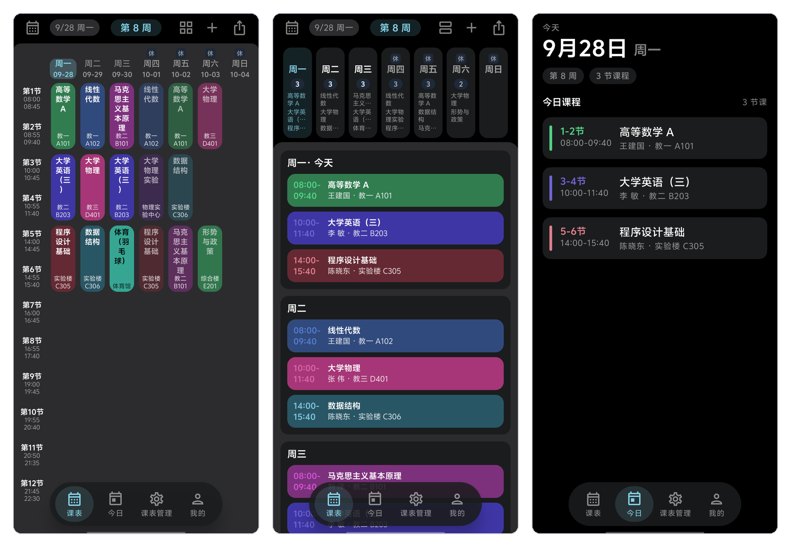
</p>

<p align="center"><sub>深色模式：网格 / 周视图 / 今日</sub></p>

主题色的来源有三条路，都在「我的 → 外观与主题」里切换：

| 方式 | 说明 |
|---|---|
| **跟随系统** | Material You 动态取色，从壁纸里取色（Android 12+；低版本自动回落到默认预设） |
| **内置预设** | 淡紫 · 春绿 · 海蓝 · 蜜桃粉 · 石板灰，每套都含浅色与深色两份 |
| **自定义** | 取色器自己调主色 / 次色 / 强调色，存成卡片长期使用，可随时删改 |

| 外观与主题（浅色） | 外观与主题（深色） |
|---|---|
| 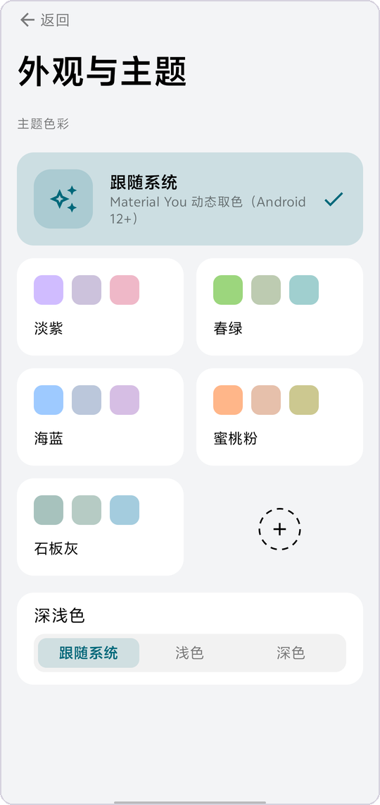 | 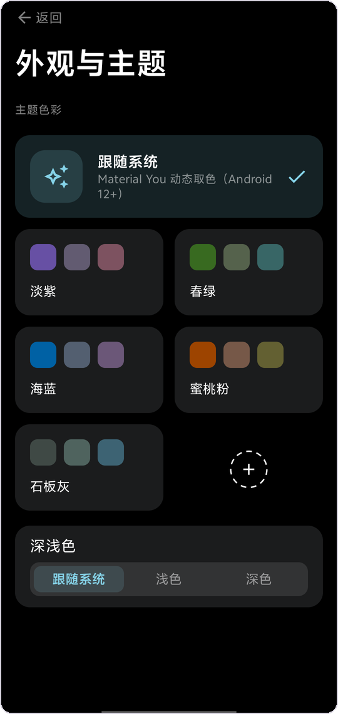 |

> 深浅色可选「跟随系统 / 浅色 / 深色」三态。底栏也有两种形态：贴底通栏，或悬浮药丸。

**课程色**也是一套自己的体系：色相取自一条等间距的环形色带（去掉容易发浊的暖黄段），按整张表的课程分配 —— 同一张表里前 9 门课色相互不相同、相邻课程的色相拉得最开；同一门课在网格 / 周视图 / 今日 / 下次重新导入后都是同一个颜色。承载方式可选：

| 通用设置（浅色） | 通用设置（深色） |
|---|---|
| 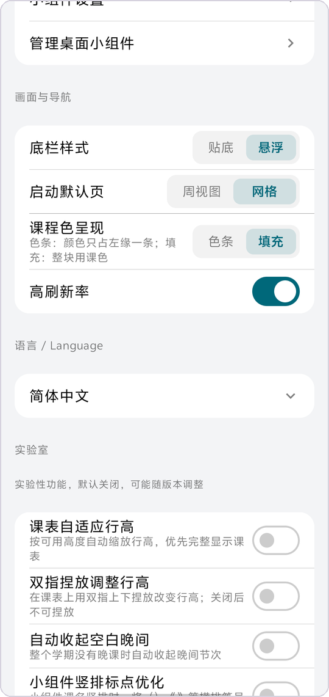 | 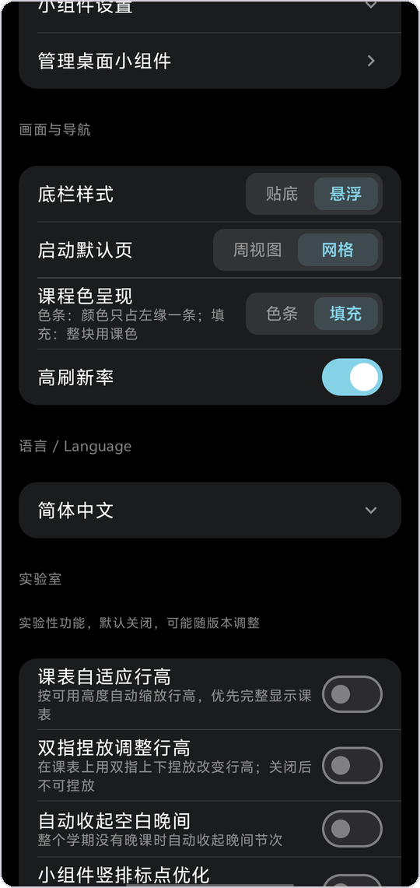 |

**两种承载方式**都保留，默认「填充」，想要更克制就切「色条」——下表左右对比（上排浅色 / 下排深色）：

| | **填充**（默认） | **色条** |
|---|---|---|
| **浅色** | 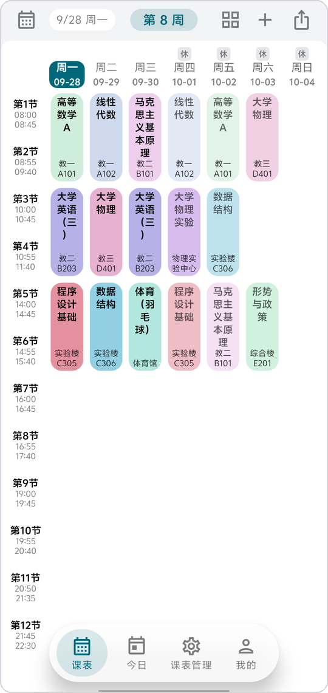 | 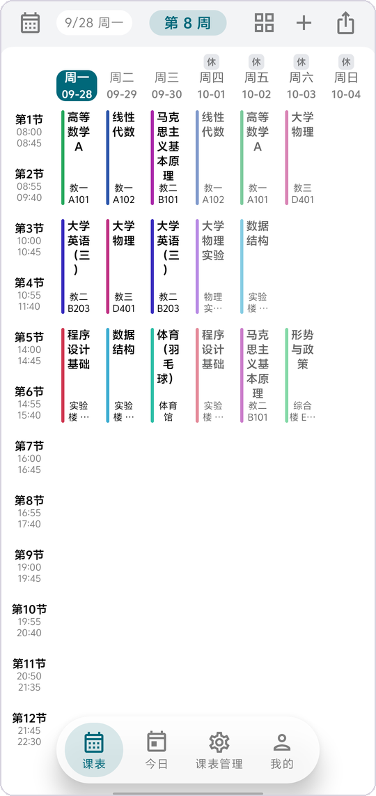 |
| **深色** | 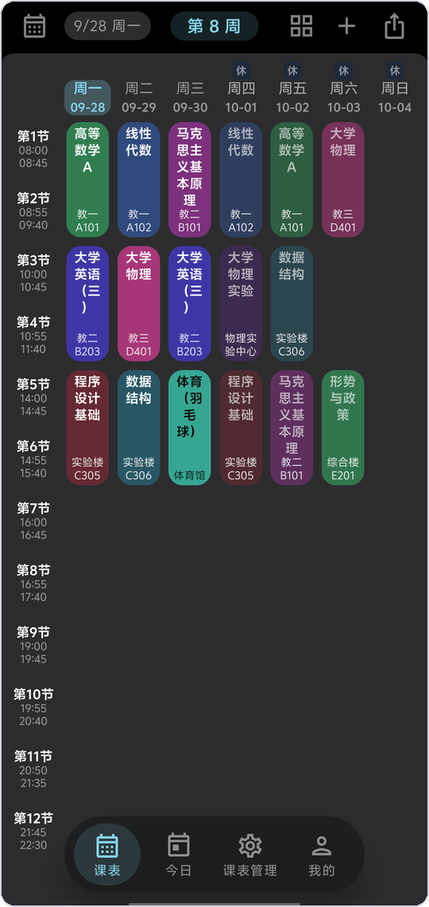 | 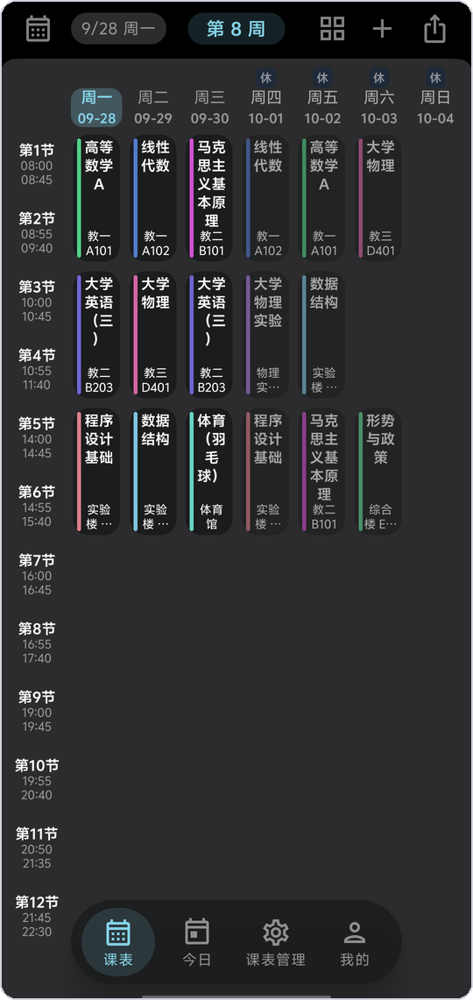 |

## 桌面小组件

<p align="center">
  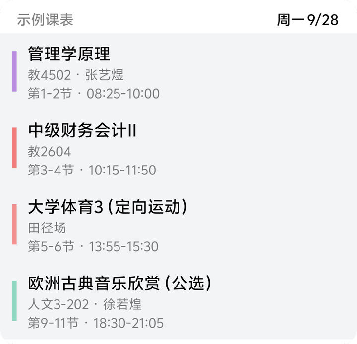
  &nbsp;&nbsp;
  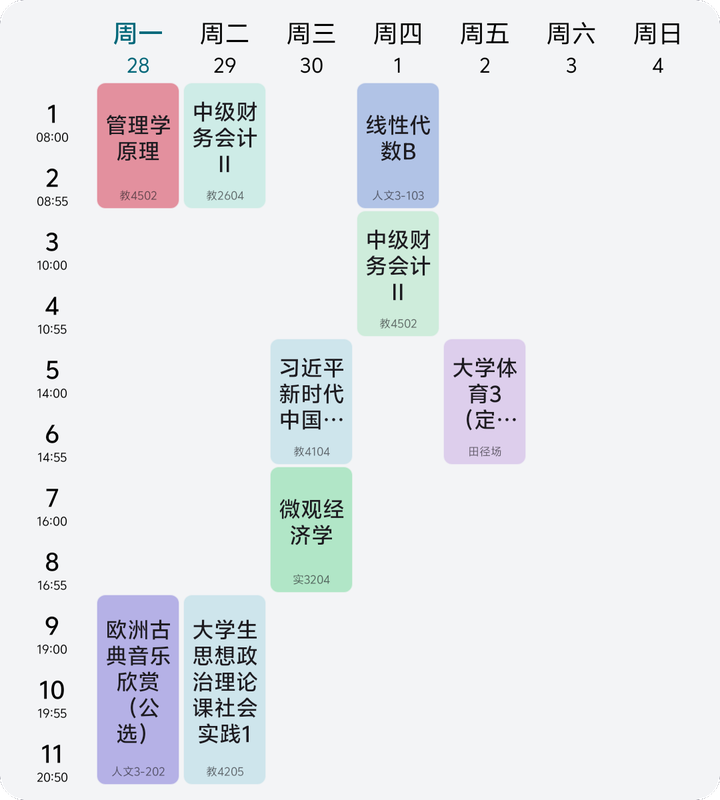
</p>

<p align="center"><sub>左：今日课程（真实行布局，可滚动） · 右：本周课表网格</sub></p>

三个组件共用同一套取数与渲染路径，与 App 内表头、「休/补」标记的口径完全一致；配色跟随主题，深浅色都不跑偏（截图见上方深色总览与本节浅色示例）。

## 导入与导出

导入入口在「课表管理 → 导入课表」，所有格式都会**先预览、再确认**，不会静默覆盖你现有的课表。

| 入口 | 说明 |
|---|---|
| **教务直连** | 选择已收录学校，或直接填教务 URL → WebView 登录 → 本地抓取解析 |
| **粘贴课表文本** | 自动识别格式：Classy 原生 / WakeUp 分享文本 / ICS / CSV / 纯文本都能认 |
| **从文件导入** | `.txt` / `.json` / `.ics` / `.csv` / `.html` 等 |

导出在「我的 → 导出课表/作息表」，课表可选 Classy 原生格式、ICS 日历、分享文本等，文件写入 `Download/Classy/`。

> Classy 原生格式的首行 magic 是 `#classy-v1`，同时**兼容读取**从上游 sleepy 导出的 `#sleepy-v1` 文本 —— 搬过来不会丢数据。

## 下载与安装

**去 [Releases](https://github.com/IMSX3D/Classy/releases/latest) 下载对应架构的 APK**，绝大多数手机选 `app-arm64-v8a-release.apk`：

1. 下载后用文件管理器点开安装（首次会提示「未知来源应用」，允许即可）；
2. 装好后打开 App，`课表管理 → 导入课表/作息表` 把课表导进来即可用。

**从 v0.0.2 起，后续版本都能直接覆盖安装升级**，不会再要求你卸载重装、数据也不会丢。

App 内 `我的 → 关于 → 获取更新` 可以就地检查并下载新版本；自 **v0.0.8** 起，启动时也会自动检查一次，
发现新版本会在「关于」页顶部提示（只是提醒，不会自作主张下载 —— 装不装永远你说了算；
检查失败就静默跳过，不弹错、不影响启动）。不想让它联网，在「关于」页关掉「自动检查更新」即可。

> 三个资产按 ABI 分列（`app-<abi>-release.apk`），应用内更新检查就是按这个名字找的 ——
> 所以每个 release 都必须把三个都传上去。

目前仅提供 Android 版。其他平台可尝试通过导出的 ICS 文件在支持该格式的日历中查看课程。

## 从源码构建

前置：JDK 17+、Android SDK（Platform 37 + Build Tools）。

```bash
git clone https://github.com/IMSX3D/Classy.git
cd Classy

# Debug（arm64 真机）
./gradlew assembleDebug
adb install app/build/outputs/apk/debug/app-arm64-v8a-debug.apk

# Release（含 R8 压缩）
./gradlew assembleRelease
```

Windows 原生环境请用 `gradlew.bat`，并把 `JAVA_HOME` 指到 JDK 根目录、`ANDROID_HOME` 指到 SDK 根目录（或写进 `local.properties` 的 `sdk.dir`）。首次构建需要联网拉依赖。

> **签名**：仓库里**不含**密钥库与口令（两者都在源码树之外）。你自己的 clone 构建 release 时会自动回退到 debug 签名 ——
> 能装能跑，只是不能覆盖升级官方包。项目自己的发包流程是：密钥库位置以 `app/build.gradle.kts` 中的配置为准 + 口令写进 `local.properties`
> （`classy.storePassword` / `classy.keyAlias` / `classy.keyPassword`），构建脚本检测到密钥库就走自有签名。
> 自 **v0.0.2** 起所有 release 包都由它签名（证书主体 `CN=Classy 课表`，SHA-256 `95:9D:7F:…:68:56`），
> 装过 v0.0.2 及以后版本的机器都能直接覆盖升级。


## 反馈与参与

遇到导入问题，请提供学校名称、教务系统类型与脱敏后的错误信息，勿提交账号、密码或登录凭据。

[问题反馈](https://github.com/IMSX3D/Classy/issues) · [贡献指南](../CONTRIBUTING.md) · [安全政策](../SECURITY.md)
