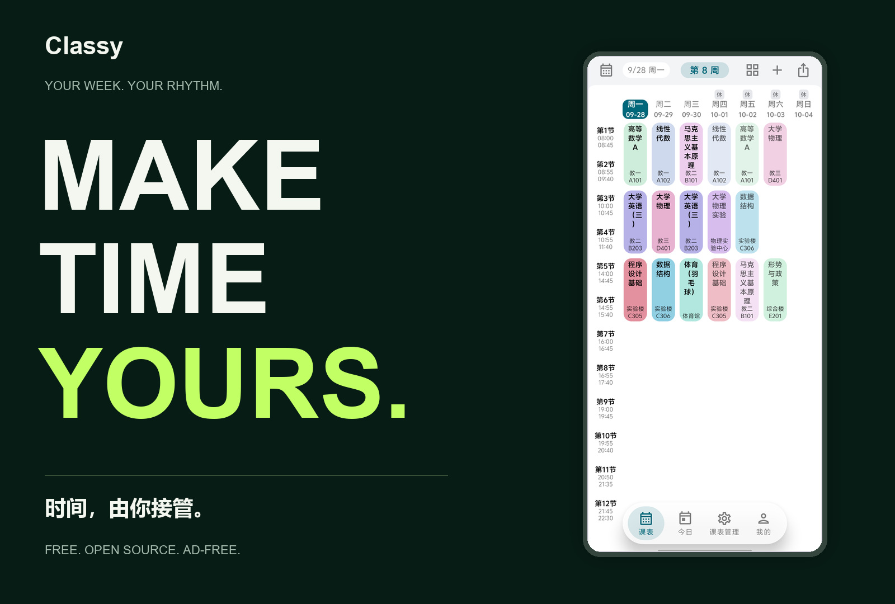
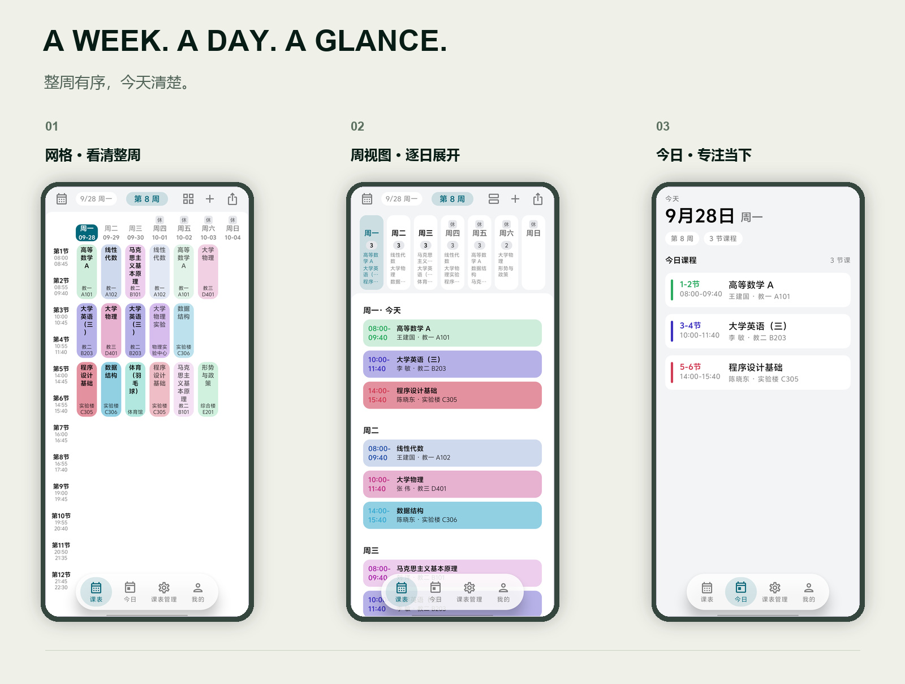
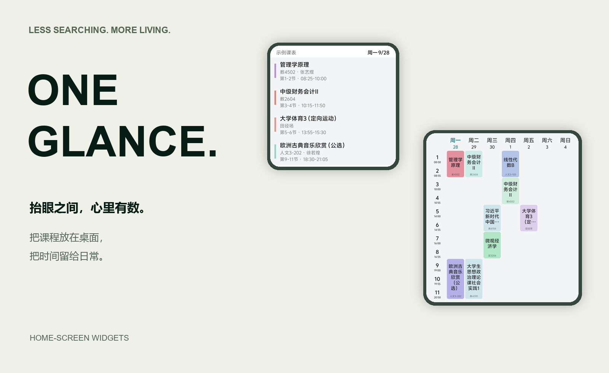
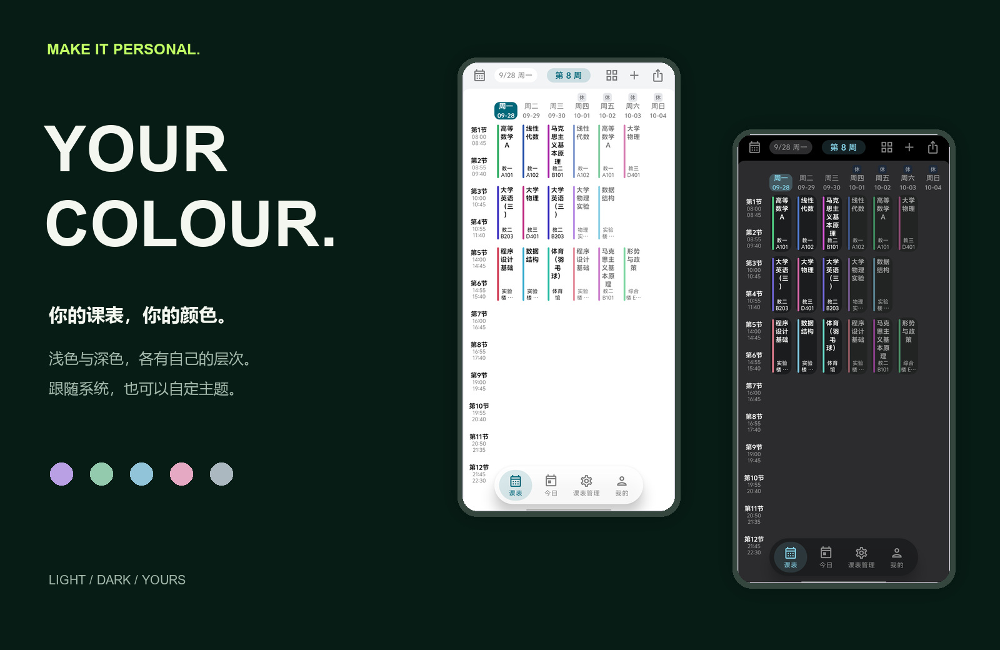

<h1 align="center">Classy</h1>

<strong>MAKE TIME YOURS.</strong> A free, open-source, ad-free timetable for Android.

<a href="https://github.com/IMSX3D/Classy/releases/latest"><strong>Download for Android ↗</strong></a> · <a href="../README.md">简体中文</a>

## Every week has a rhythm of its own.

Your timetable should give you clarity at a glance, without taking more of your time.

From the shape of your week, to today's classes, to a glance at your home screen. Classy makes your schedule part of everyday life — and puts your time back in your hands.

## See Classy in motion.

Two cuts. One idea: make time yours. Press play. Sound on.

### Brand film · 52 seconds

https://github.com/user-attachments/assets/9a90d1ed-8ecb-4a7f-b33d-9435bee4dce9

### Short film · 30.2 seconds

https://github.com/user-attachments/assets/ac7be139-0f8a-4b4d-9d15-6163afba1d20

3:4 format, Chinese and English captions. Films include conceptual motion graphics; actual app screens appear below.

## See the week. Focus on today.

Switch between a timetable grid, a day-by-day week view and today's classes. Keep course names, times and rooms in view, at the scale you need.

## One glance. Then get on with your day.

Today, Next Two Days and Week Grid widgets bring your schedule to the home screen, with colours that follow the app theme.

## Your timetable. Your colours.

Light and dark themes, built-in palettes and custom colours. Dynamic colour on Android 12 and later. Choose full-colour course cards or a quieter accent bar.

The images recompose genuine app screenshots with demonstration courses. Backgrounds and editorial headings are promotional artwork; the pictured app interface is in Chinese.

## Your time. Your data.

- **Ad-free, with no advertising or analytics SDKs.**
- **Local-first.** Your timetable stays on your device and everyday viewing works offline. Academic-system import, holiday data and update checks use the network. Automatic update checks can be disabled in About.
- **Bring it in. Take it with you.** Import from supported academic systems or formats including Classy, ICS, CSV, WakeUp share text / JSON and HTML tables. Preview before confirming, and export your timetable when you need it elsewhere.

Academic-system import parses data locally after school login, without a Classy relay server. Compatibility depends on the school's system.

## Classy is available now.

[**Download the latest Android release ↗**](https://github.com/IMSX3D/Classy/releases/latest)

[v0.09 release notes](../docs/releases/v0.09.md): drag classes, arrange daily lesson times, clearer settings, and an offline update summary after upgrades.

Requires Android 8.0 or later. Most phones should use `app-arm64-v8a-release.apk`. Other architectures are available on Releases. Native iOS is not currently available.

## Built in the open.

Classy is a [GPL-3.0](../LICENSE) fork of [lingion/sleepy](https://github.com/lingion/sleepy), with redesigned UI, themes and widgets. Its timetable foundation and academic-system parsers build on the upstream project.

Thanks to [lingion](https://github.com/lingion), [Nevodev](https://github.com/Nevodev) for [Cresto](https://github.com/Nevodev/Cresto) / [Pear Wall](https://github.com/Nevodev/Pear-Wall), and [Kyant0](https://github.com/kyant0) for [shapes](https://github.com/kyant0/shapes) / [backdrop](https://github.com/kyant0/backdrop). Some academic-system parsing algorithms and school URL data derive from [WakeupSchedule_BUPT](https://github.com/dIT8Zv/WakeupSchedule_BUPT). These UI and parser dependencies are credited under their respective Apache-2.0 licences; see the in-app licence page for the full list.

Build with JDK 17+ and Android SDK 37: `./gradlew assembleDebug` or `./gradlew assembleRelease` (`gradlew.bat` on Windows). Without the project's signing credentials, release builds fall back to debug signing and cannot replace an officially signed installation.

[Contribute](../CONTRIBUTING.md) · [Report an issue](https://github.com/IMSX3D/Classy/issues) · [Security](../SECURITY.md) · QQ **547991704**
